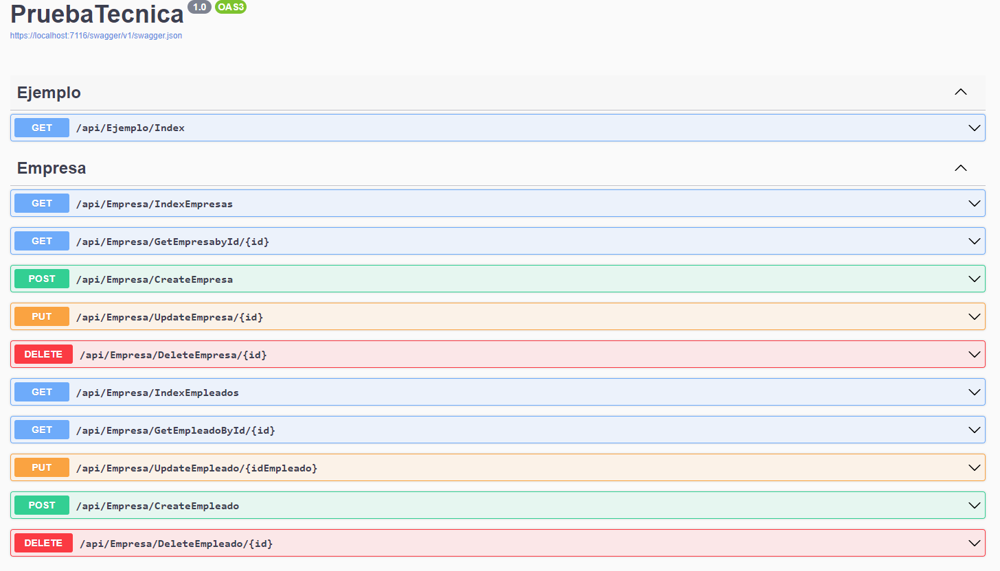
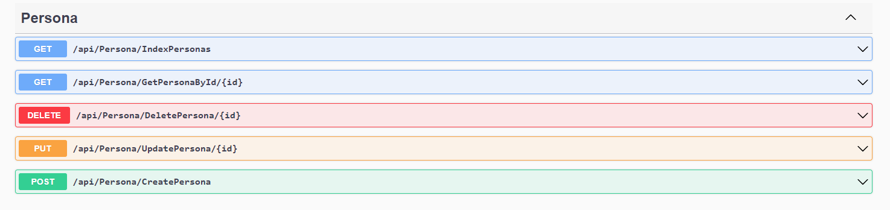

# PRUEBABACKEND

En este proyecto encontrarás los endpoints necesarios para realizar tu prueba técnica en Angular.

En caso de tener dudas en cómo se traen los datos o se guardan, puedes revisar el proyecto, especialmente los archivos de Concretes en la carpeta:

[./PruebaTecnica.Concretes](./PruebaTecnica.Concretes)

Puedes encontrar los modelos que se usan para las respuestas y peticiones de la API en la carpeta:

[./PruebaTecnica.ViewModels](./PruebaTecnica.ViewModels)

## Endpoints

Revisalos en Swagger: [swagger](https://localhost:7116/swagger/index.html)

Los endpoints disponibles son los siguientes:

### Empresa

Son los endpoints de la entidad "Empresa" y los relacionados con la entidad de "PersonaEmpresa".

**Los endpoints que tienen que ver con empleados son los que tienen como nombre algo-Empleado** dentro del mismo controlador de "Empresa".



### Persona

Son los endpoints de la entidad de persona.



Los endpoints de `getById/{id}` están en caso de que los necesites. Pero para completar la operación de CRUD para una entidad puedes usar cualquiera de las dos opciones de GET.

## Respuesta de backend

Para las respuestas se utiliza la librería de ServiceStack, así que las respuestas se verán como:

````json
{
  "responseText": null,
  "responseStream": null,
  "fileInfo": null,
  "virtualFile": null,
  "contentType": null,
  "headers": {},
  "cookies": [],
  "eTag": null,
  "age": null,
  "maxAge": null,
  "expires": null,
  "lastModified": null,
  "cacheControl": 0,
  "resultScope": null,
  "allowsPartialResponse": false,
  "options": {},
  "status": 200,
  "statusCode": 200,
  "statusDescription": null,
  "response": {
    "id": 1,
    "nombre": "PGR",
    "telefono": "78789789",
    "direccion": "SA"
  },
  "responseFilter": {},
  "requestContext": null,
  "view": null,
  "template": null,
  "paddingLength": 0,
  "isPartialRequest": false
}
````

El contenido principal de la respuesta está en: `response`

El statusCode que te interesa es el de `statusCode`